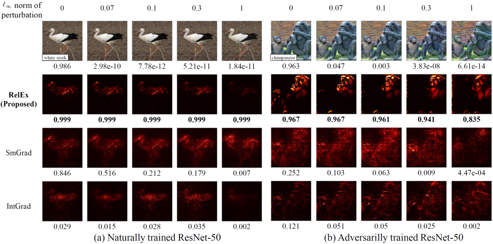
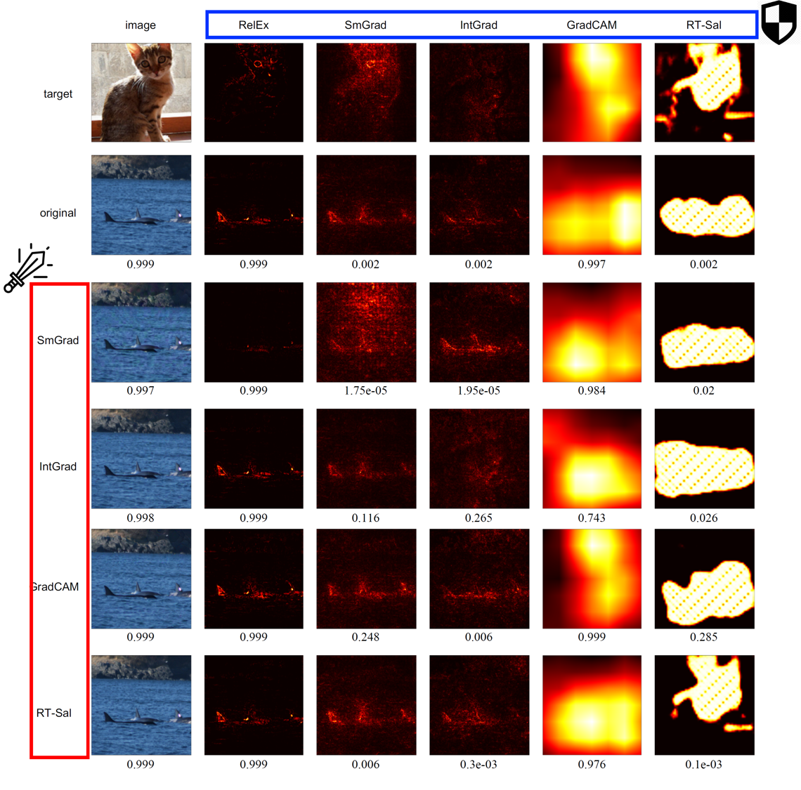
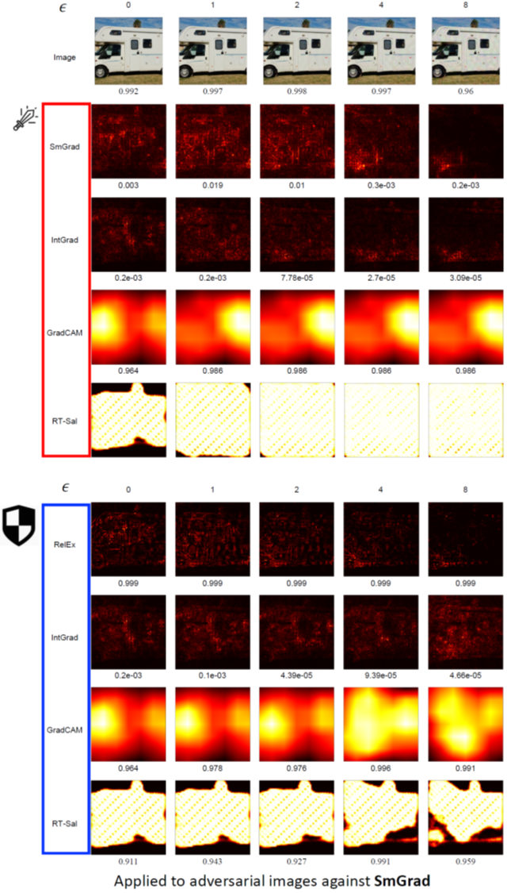

# RelEx
This repository is implementation of "Building Reliable Explanations of Unreliable Neural Networks: Locally Smoothing Perspective of Model Interpretation", CVPR 2021.

RelEx Paper: <span style="color:red">arXiv link will be here.</span>
## Authors
* Dohun Lim
* Hyeonseok Lee
* Sungchan Kim
## Usage
### Please note available methods like below.
* Adversarial method
    |method|Untargeted, PGD|Targeted, Structured|Targeted, Unstructured|
    |:---:|:---:|:---:|:---:|
    |state|:white_check_mark:|:white_check_mark:|:white_check_mark:|
    |dependency|CleverHans|N/A|N/A|
* Saliency method
    |method|Ours, RelEx|Real Time Saliency|GradCAM|DeepLIFT|SmoothGrad|Integrated Gradient|Simple Gradient|
    |:---:|:---:|:---:|:---:|:---:|:---:|:---:|:---:|
    |state|:white_check_mark:|:white_check_mark:|:white_check_mark:|:white_check_mark:|:white_check_mark:|:white_check_mark:|:white_check_mark:|
    |dependency|N/A|N/A|N/A|Captum|N/A|N/A|N/A|
#### :white_check_mark:: done, :construction:: refactoring
### Requirements
Dependencies of this implementaion are the following.
* Python == 3.6
* PyTorch >= 1.7
* CleverHans == 4.0.0
    ```
    pip install git+https://github.com/tensorflow/cleverhans.git#egg=cleverhans
    ```
* Captum >= 0.3.1
    ```
    pip install captum
    ```
### Running the code
Generating adversarial example and saliency via the command.
```
python generate.py [(options)]
```
Evaluating saliency via the command.
```
python eval.py [(options)]
```
#### options
* --robust: Flag whether select naturally trained or adversarilly trained model

#### Our method example
```python
import os
from models.saliency import RelEx
from models.network import load_network
from utils import load_image

workspace_dir = os.path.dirname(__file__)
data_root_dir = os.path.join(workspace_dir, 'data')

x_name = 'ILSVRC2012_val_00023552'
if torch.cuda.is_available():
    device = torch.device('cuda')
else:
    device = torch.device('cpu')

x_full_dir = os.path.join(data_root_dir, x_name + '.JPEG')
x = load_image(x_full_dir, gpu=True)[0]

net = load_network('resnet50', encoder=False, robust=False).to(device)
target_cls = net(x).max(1)[1]
relex = RelEx(net, device=device)
sal, accu = relex(x, target_cls)
```
## Adversarial defense example
### Untargeted Attack
</img>
### Structured Attack
</img>
### Unstructured Attack
</img>


## Reference of Algorithms
* Adversarial
    * Untargeted, PGD: [Towards Deep Learning Models Resistant to Adversarial Attacks](https://arxiv.org/abs/1706.06083)
    * Targeted, Structured: [Explanations can be manipulated and geometry is to blame](https://arxiv.org/abs/1906.07983) 
    * Targeted, Unstructured: [Interpretation of Neural Networks is Fragile](https://arxiv.org/abs/1710.10547)
* Saliency
    * Real Time Saliency: [Real Time Image Saliency for Black Box Classifiers](https://arxiv.org/abs/1705.07857)
    * GradCAM: [Grad-CAM: Visual Explanations from Deep Networks via Gradient-based Localization](https://arxiv.org/abs/1610.02391)
    * DeepLIFT: [Learning Important Features Through Propagating Activation Differences](https://arxiv.org/abs/1704.02685)
    * SmoothGrad: [SmoothGrad: removing noise by adding noise](https://arxiv.org/abs/1706.03825)
    * Integrated Gradient: [Axiomatic Attribution for Deep Networks](https://arxiv.org/abs/1703.01365)
    * Simple Gradient: [Deep Inside Convolutional Networks: Visualising Image Classification Models and Saliency Maps](https://arxiv.org/abs/1312.6034)
* Network
    * Robust ResNet-50: [Robustness May Be at Odds with Accuracy](https://arxiv.org/abs/1805.12152)