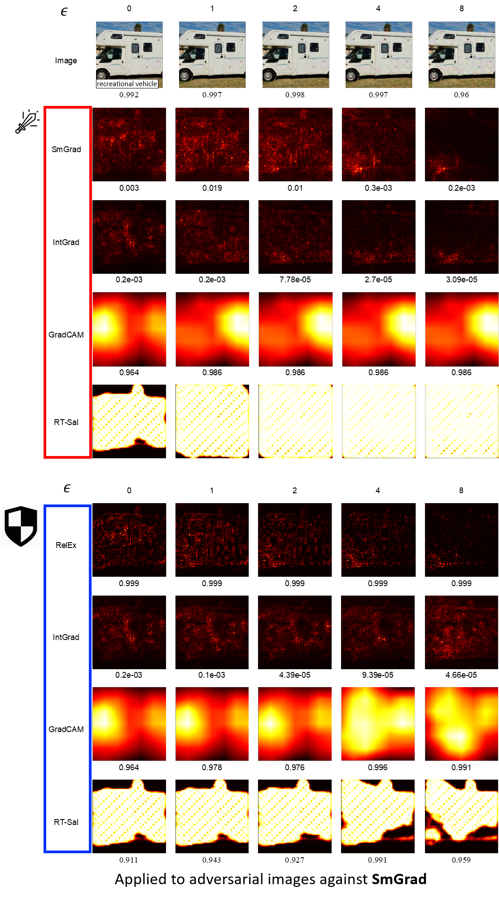

# RelEx
This repository is implementation of "Building Reliable Explanations of Unreliable Neural Networks: Locally Smoothing Perspective of Model Interpretation", CVPR 2021(poster).

RelEx Paper: arXiv link will be here.

## Usage
### Please note available methods like below.
* Adversarial method
    |method|Untargeted, PGD|Targeted, Structured|Targeted, Unstructured|
    |:---:|:---:|:---:|:---:|
    |state|:white_check_mark:|:white_check_mark:|:white_check_mark:|
* Saliency method
    |method|Ours, RelEx|Real Time Saliency|GradCAM|DeepLIFT|SmoothGrad|Integrated Gradient|Simple Gradient|
    |:---:|:---:|:---:|:---:|:---:|:---:|:---:|:---:|
    |state|:white_check_mark:|:white_check_mark:|:white_check_mark:|:construction:|:white_check_mark:|:white_check_mark:|:construction:|
#### :white_check_mark:: done, :construction:: refactoring
### Prerequisites
details will be here.
### Running the code
details will be here.
## Adversarial defense example
### Untargeted Attack
</img>
### Structured Attack
</img>
### Unstructured Attack
</img>

## Reference of Methods
* Adversarial method
    * Untargeted, PGD: [Towards Deep Learning Models Resistant to Adversarial Attacks](https://arxiv.org/abs/1706.06083)
    * Targeted, Structured: [Explanations can be manipulated and geometry is to blame](https://arxiv.org/abs/1906.07983) 
    * Targeted, Unstructured: [Interpretation of Neural Networks is Fragile](https://arxiv.org/abs/1710.10547)
* Saliency method
    * Real Time Saliency: [Real Time Image Saliency for Black Box Classifiers](https://arxiv.org/abs/1705.07857)
    * GradCAM: [Grad-CAM: Visual Explanations from Deep Networks via Gradient-based Localization](https://arxiv.org/abs/1610.02391)
    * DeepLIFT: [Learning Important Features Through Propagating Activation Differences](https://arxiv.org/abs/1704.02685)
    * SmoothGrad: [SmoothGrad: removing noise by adding noise](https://arxiv.org/abs/1706.03825)
    * Integrated Gradient: [Axiomatic Attribution for Deep Networks](https://arxiv.org/abs/1703.01365)
    * Simple Gradient: [Deep Inside Convolutional Networks: Visualising Image Classification Models and Saliency Maps](https://arxiv.org/abs/1312.6034)